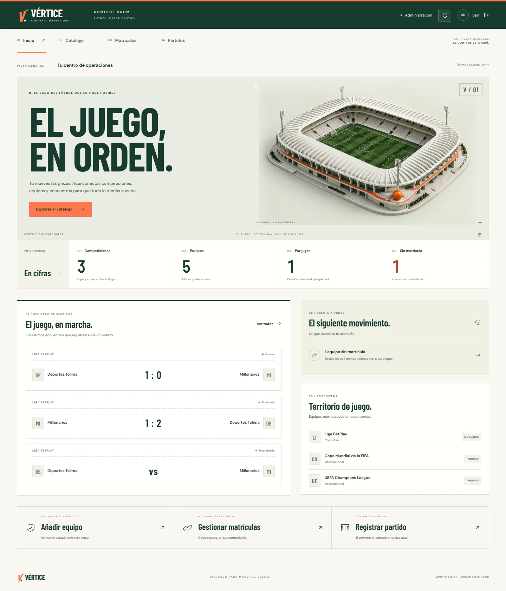

# VÉRTICE

El fútbol tiene más conexiones de las que caben en un marcador. VÉRTICE es un proyecto personal para explorarlas: entrar por un partido, entender su contexto y seguir hacia un equipo, una competición o una historia que no conocías.

Lo que puedes ejecutar hoy es **el administrador**, no la web pública. Es la mesa de trabajo donde se organiza la información que alimentará esa experiencia.



*Captura de la aplicación funcionando con datos de demostración en una base local desechable. Los marcadores no representan resultados reales.*

## Qué hay funcionando

El panel tiene cuatro espacios:

| Espacio | Para qué sirve |
| --- | --- |
| Inicio | Ver los totales del catálogo, los últimos partidos registrados y las referencias que necesitan atención. |
| Catálogo | Crear y editar confederaciones, competiciones y equipos. Buscar por nombre y filtrar por país, confederación, tipo o matrícula. |
| Matrículas | Inscribir equipos en las competiciones que les corresponden y revisar su participación. |
| Partidos | Registrar encuentros, consultar sus marcadores y filtrar por estado. |

La API comprueba las reglas de participación: tipo de equipo, país y confederación. Para registrar un partido, ambos equipos deben estar matriculados en el torneo. También permite guardar posesión y tiros a puerta, aunque todavía no hay un editor de estadísticas en el panel.

El inicio muestra lo que hay en la base, sin actividad inventada. “En vivo” es un estado que se registra manualmente: todavía no existe un proveedor que actualice resultados.

## Levantarlo en local

Necesitas Git, Python 3.12 y Docker con Compose. No necesitas instalar Node ni PostgreSQL en tu máquina para usar el conjunto con Docker.

```bash
git clone https://github.com/MizunDev/vertice.git
cd vertice
python -m src.configure
docker compose up --build -d
```

En Linux, usa `python3` si tu instalación no tiene el comando `python`.

El asistente pide un usuario y una contraseña para el administrador y crea tu `.env`. No hay una contraseña universal. La contraseña del administrador se guarda como hash; la de PostgreSQL queda en ese archivo local, que no se sube a Git.

Abre [localhost](http://localhost) e inicia sesión con lo que acabas de configurar. La documentación de la API está en [localhost/api/docs](http://localhost/api/docs).

Si ya tenías una base en Docker, conserva su contraseña cuando el asistente la pida. Si ya tienes `.env`, no vuelvas a ejecutar el asistente: revisa tu archivo con [.env.example](.env.example) como referencia.

### Actualizar sin perder los datos

Desde la raíz del repositorio:

```bash
git pull --ff-only
docker compose up --build -d
```

Si Git avisa de cambios locales, revísalos antes de continuar; no hace falta descartarlos para actualizar.

Para detenerlo:

```bash
docker compose down
```

La base se conserva en el volumen `postgres_data`. No añadas `-v` si quieres mantenerla.

### Si algo no arranca

```bash
docker compose ps
docker compose logs api --tail=80
```

- **Puerto 80 ocupado:** cambia `FRONTEND_PORT=8080` en `.env`, vuelve a ejecutar Compose y abre [localhost:8080](http://localhost:8080).
- **Puerto 5432 ocupado:** el Compose actual no publica PostgreSQL en el anfitrión. Si sigue apareciendo ese error, revisa si conservas un Compose antiguo o un archivo de override.
- **`password authentication failed`:** la contraseña de `.env` no coincide con la del volumen PostgreSQL. Cambiar `.env` no cambia una base ya inicializada. Recupera la contraseña correcta o restablécela dentro de PostgreSQL; no borres el volumen para resolverlo.
- **Login correcto, pero vuelve a pedir sesión:** en HTTP local necesitas `COOKIE_SECURE=false`. En HTTPS debe ser `true`. Aplica los cambios con `docker compose up -d`.

## Trabajar en el proyecto

La API usa Python, FastAPI y SQLModel; la base es PostgreSQL 15. El administrador está hecho con React 19 y Vite, con un sistema visual propio en CSS. NGINX sirve el frontend y dirige `/api` al backend.

| Carpeta | Contenido |
| --- | --- |
| `frontend/src/` | Interfaz, llamadas a la API y filtros del administrador. |
| `frontend/public/` | Tipografías y renders locales. |
| `src/` | Modelos, rutas, autenticación, configuración y datos iniciales. |
| `tests/` | Pruebas de la API y de la configuración. |
| `frontend/e2e/` | Recorridos de navegador contra la aplicación real. |
| `scripts/` | Comprobación de arranque a través de NGINX. |
| `docs/` | Decisiones de producto, experiencia y datos. |

### Frontend con recarga automática

Con la API de Docker en marcha, usa Node 24:

```bash
cd frontend
npm ci
npm run dev
```

Vite muestra la dirección local y reenvía `/api` a `http://127.0.0.1:8000`. Si el backend está en otro sitio, configura `API_PROXY_TARGET` en `frontend/.env.local`. Más detalles en [frontend/README.md](frontend/README.md).

### Pruebas

Desde la raíz:

```bash
python -m venv .venv
source .venv/bin/activate
python -m pip install -r requirements.txt
python -m pytest -q
```

Desde `frontend/`:

```bash
npm ci
npm test
npm run lint
npm run build
```

Las pruebas de Python usan SQLite en memoria por defecto. `TEST_DATABASE_URL` permite probar PostgreSQL, pero debe apuntar a una base desechable: las pruebas crean y eliminan tablas. No uses tu base de trabajo.

GitHub Actions comprueba la API contra PostgreSQL, las pruebas y la compilación del frontend, y el conjunto Docker con NGINX. Los recorridos de navegador cubren login, edición, matrículas, registro de partidos, persistencia de sesión y móvil.

## Configuración y despliegue

Las variables están documentadas en [.env.example](.env.example). La configuración de acceso requiere `SECRET_KEY`, `ADMIN_USERNAME` y `ADMIN_PASSWORD_HASH`; PostgreSQL requiere `POSTGRES_PASSWORD`.

Para exponer el panel fuera de tu máquina, configura HTTPS y `COOKIE_SECURE=true`. No publiques `.env`. La sesión usa una cookie HttpOnly con caducidad y se invalida al cambiar `SECRET_KEY`. La API directa solo escucha en `127.0.0.1:8000`; PostgreSQL queda dentro de la red de Docker.

pgAdmin es opcional. Define `PGADMIN_DEFAULT_EMAIL` y `PGADMIN_DEFAULT_PASSWORD` en `.env`, y ejecuta:

```bash
docker compose --profile admin up -d pgadmin
```

Quedará en [localhost:5050](http://localhost:5050). Para conectarlo a la base, el servidor es `db`, el puerto `5432`, el usuario `postgres` y la base `vertice_db`.

## Lo que sigue

La experiencia pública aún está por construir. Antes de llenarla de pantallas, faltan fechas y contexto de los encuentros, ediciones y fases de competiciones, y una fuente de datos verificable. Los jugadores, las alineaciones, los eventos y la actualización automática también quedan por delante.

La intención es empezar por el fútbol colombiano y las competiciones de CONMEBOL, sin cerrar el modelo a otros países. Esto también es un proyecto para aprender construyendo: las decisiones deben poder entenderse y cambiar cuando haga falta.

[Visión del producto](docs/vision.md) · [Experiencia y diseño](docs/ux.md) · [Modelo de datos](docs/data.md)
